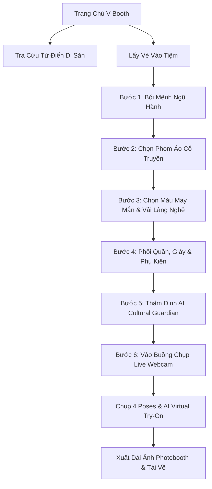

<div align="center">

# 🏮 V-Booth: Tiệm Photobooth Việt Phục Ảo

**Nền tảng Stylist Di Sản, Thử Đồ Đa Tầng & Mua Sắm Tiết Kiệm Cho Gen Z Kết Hợp AI Cultural Guardian và In Dải Ảnh Photobooth Retro**

[](https://react.dev/)
[](https://www.typescriptlang.org/)
[](https://tailwindcss.com/)
[](https://expressjs.com/)
[](https://ai.google.dev/)
[](LICENSE)

[🌐 Trải Nghiệm Demo Trực Tiếp](https://github.com/huyanhdeptrai/V-Booth) • [📖 Xem Từ Điển Di Sản](#-từ-điển-di-sản-heritage-wiki) • [🚀 Hướng Dẫn Cài Đặt](#-hướng-dẫn-cài-đặt--chạy-dự-án)

</div>

---

## 📌 Giới Thiệu Tổng Quan

**V-Booth (Việt-Booth)** là ứng dụng web kết hợp giữa tình yêu di sản văn hóa Việt Nam và trào lưu chụp ảnh Photobooth retro được giới trẻ Gen Z đặc biệt yêu thích.

Dự án ra đời với sứ mệnh:
1. **Bình dân hóa cổ phục**: Giúp các bạn trẻ dễ dàng ướm thử trang phục truyền thống của cha ông mà không tốn chi phí thuê/may đo đắt đỏ.
2. **Bảo tồn tính chuẩn mực văn hóa (Cultural Guardian)**: Giữ gìn phom dáng, cổ lập lĩnh, vạt áo hữu nhậm và quy thức điển lễ qua công nghệ AI kiểm duyệt.
3. **Phong cách Neo-Heritage & Y2K**: Kết hợp hài hòa nét cổ kính của tơ lụa Việt Nam với các phụ kiện đương đại như chunky sneaker, kính mát Y2K, tai nghe chụp tai...

---

## ✨ Các Tính Năng Trọng Tâm

### 🔮 1. Bói Mệnh Ngũ Hành & Sắc Phục May Mắn (Horoscope Stylist)
- Tự động tính Can Chi, xác định Nạp âm bản mệnh (*Kim, Mộc, Thủy, Hỏa, Thổ*) dựa trên ngày tháng năm sinh và giới tính.
- AI sinh **"Lời sấm phong cách"** hóm hỉnh chuẩn ngôn ngữ Gen Z.
- Gợi ý bảng màu tương sinh may mắn và cảnh báo màu tương khắc.

### 👘 2. Bàn Thử Đồ Đa Tầng 5 Bước (Multi-Layer Heritage Fitting)
- **5 Dòng cổ phục kinh điển**:
  - **Áo Tấc (Áo Thụng Ngũ Thân)**: Đại lễ phục triều Nguyễn, tay thụng rộng, cổ lập lĩnh nghiêm cẩn, 5 khuy ngũ thường (*Nhân - Lễ - Nghĩa - Trí - Tín*).
  - **Áo Ngũ Thân Tay Chẽn**: Thường phục thanh lịch, tay bó sát cẳng tay, tiền thân của Áo Dài tân thời.
  - **Áo Nhật Bình**: Tuyệt tác lễ phục của Hậu phi, Công chúa triều Nguyễn; cổ áo chữ nhật hoa văn tinh xảo, dải tay dệt ngũ sắc.
  - **Áo Tứ Thân Kinh Bắc**: Nét đẹp quan họ vùng Kinh Bắc, yếm đào e ấp, lưng ong thướt tha, nón quai thao trẩy hội.
  - **Áo Bà Ba Nam Bộ**: Hồn cốt hào sảng phương Nam, vạt xẻ hông linh hoạt, dệt từ lụa hoặc vải Lãnh Mỹ A.
- **Tùy biến chất liệu vải thủ công làng nghề**: Lãnh Mỹ A (Tân Châu), Lụa Vạn Phúc (Hà Đông), Đũi Nam Cao (Thái Bình), Gấm Cung Đình (Huế), Sa/Xuyến lụa mỏng nhẹ.
- **Hệ thống X-Ray Phân Tích Cấu Trúc Áo**: Hiển thị các điểm chạm giải phẫu học thời trang và câu chuyện văn hóa từng chi tiết.

### 🛡️ 3. Người Gác Cổng Di Sản (AI Cultural Guardian)
- Chấm điểm chuẩn mực văn hóa thời gian thực (thang điểm 0 - 100).
- Trao **Mộc triện di sản** và danh hiệu phong cách Gen Z (*"Tiểu thư Ngũ Thân Y2K", "Bá Kiến Trượt Ván", "Nàng Thơ Quan Họ"*).
- Bắt lỗi biến tướng sai lệch:
  - ❌ Cắt xẻ tà áo ngắn hở eo phản cảm.
  - ❌ Kiêng kỵ cài ngược vạt khuy sang bên trái (*tả nhậm* là điều kỵ trong phong tục Việt).
  - ❌ Mặc lễ phục cung đình Nhật Bình đi bar/vũ trường.

### 📚 4. Từ Điển Di Sản (Heritage Wiki Archive)
- Tích hợp trực tiếp trên thanh điều hướng Navbar.
- **Tab 1: 5 Dòng Cổ Phục Tiêu Biểu**: Thông tin chi tiết, đặc trưng cốt lõi, ý nghĩa 5 khuy ngũ thường và tứ thân phụ mẫu.
- **Tab 2: Điển Lễ & Hoàn Cảnh Sử Dụng**: Gợi ý phối đồ cho lễ tốt nghiệp/kỷ yếu, trẩy hội du xuân, đám cưới hôn lễ gia tiên.
- Nút tương tác nhanh **"Mặc thử phom áo này →"** giúp đưa ngay phom áo vào buồng thử.

### 📸 5. Buồng Chụp Ảo & AI Virtual Try-On
- WebRTC Camera soi gương trực tiếp với hiệu ứng đếm ngược **3... 2... 1... Flash!**.
- Tích hợp chuẩn **`POST /v1/images/edits`** và Cloud AI Engine: AI tự động phân tích khuôn mặt, dáng người và khoác trang phục truyền thống vừa vặn lên ảnh chụp thật.

### 🎞️ 6. In Dải Ảnh Photobooth Retro (V-Print Strip)
- Tạo dải ảnh 4 ô dọc chuẩn studio Hàn Quốc với nhiều tùy chọn khung màu pastel / retro.
- Đóng dấu mộc triện bản quyền di sản, ngày giờ và câu danh ngôn phong cách.
- Hỗ trợ xuất ảnh độ phân giải cao (HD), quét mã QR tải về điện thoại hoặc in trực tiếp.

### 🛍️ 7. Smart Shopping & Bóc Tách Chi Phí Sinh Viên
- Phân loại rõ ràng: **THUÊ** (100k-180k/ngày) • **MUA SHOPEE** (30k-90k) • **TẬN DỤNG CÓ SẴN** (quần âu, sneaker trắng).
- Gợi ý từ khóa Shopee tìm kiếm chính xác và địa chỉ các tiệm thuê cổ phục uy tín tại Hà Nội, Huế, TP.HCM.

---

## 🛠️ Công Nghệ Sử Dụng (Tech Stack)

| Thành Phần | Công Nghệ | Mô Tả |
|------------|-----------|-------|
| **Frontend** | React 19, TypeScript, Vite | Nền tảng ứng dụng SPA tốc độ cao |
| **Styling** | Tailwind CSS v4 | Thiết kế giao diện hiện đại, chuẩn Neo-Heritage |
| **Icons** | Lucide React | Bộ biểu tượng giao diện tối giản |
| **Backend** | Node.js, Express, Multer | Server xử lý API, tải file và tích hợp AI proxy |
| **Trí Tuệ Nhân Tạo** | Google GenAI SDK (`@google/genai`) | Mô hình **`gemini-3.8-flash`** phân tích bản mệnh, chấm điểm di sản |
| **Xử Lý Ảnh AI** | Cloud AI Try-On Engine & ChatGPT2API | Đắp trang phục cổ truyền vào ảnh selfie |
| **Camera & Canvas** | WebRTC MediaStream, HTML5 Canvas | Thu luồng webcam, soi gương và vẽ dải ảnh Photobooth |

---

## 📂 Cấu Trúc Thư Mục (Project Structure)

```
V-Booth/
├── src/
│   ├── assets/images/          # Hình ảnh demo, poster, lookbook di sản
│   ├── components/
│   │   ├── AvatarCanvas.tsx     # Bộ dựng hình nhân vật & trang phục trực quan
│   │   ├── FittingRoom.tsx      # Bàn chuẩn bị & soi gương phối đồ 5 bước
│   │   ├── GarmentVisual.tsx    # Bản vẽ vector silhouette các phom áo
│   │   ├── HeritageWikiModal.tsx# Giao diện Từ Điển Di Sản & điển lễ
│   │   ├── LandingPage.tsx      # Trang chủ giới thiệu, lookbook và vé vào tiệm
│   │   ├── PhotoBoothCabin.tsx  # Buồng chụp ảnh 4 ô live webcam
│   │   ├── PhotoStripPrinter.tsx# Trình xuất và in dải ảnh Photobooth retro
│   │   └── VBoothLogo.tsx       # Logo thương hiệu V-Booth
│   ├── data/
│   │   ├── garments.ts          # Cơ sở dữ liệu 5 dòng áo, vải, phụ kiện & quy chuẩn
│   │   └── horoscope.ts         # Thuật toán tính Can Chi & Nạp âm Ngũ Hành
│   ├── services/
│   │   ├── geminiService.ts     # Client kết nối API phân tích di sản & bói mệnh
│   │   └── tryOnService.ts      # Client gửi ảnh đến AI Virtual Try-On
│   ├── App.tsx                  # Điều hướng chính của ứng dụng
│   ├── main.tsx                 # Điểm khởi chạy React
│   └── index.css                # Global CSS & Tailwind configuration
├── server.ts                    # Backend Express + Vite middleware + Gemini proxy
├── package.json                 # Cấu hình dependencies và scripts
├── tsconfig.json                # Cấu hình TypeScript
├── vite.config.ts               # Cấu hình Vite & Tailwind
└── README.md                    # Tài liệu dự án
```

---

## 🚀 Hướng Dẫn Cài Đặt & Chạy Dự Án

### 1. Yêu Cầu Tiên Quyết
- Đã cài đặt [Node.js](https://nodejs.org/) (phiên bản 18 trở lên).
- Trình quản lý gói `npm` (hoặc `bun` / `pnpm`).

### 2. Tải Mã Nguồn
```bash
git clone https://github.com/huyanhdeptrai/V-Booth.git
cd V-Booth
```

### 3. Cài Đặt Gói Phụ Thuộc
```bash
npm install
```

### 4. Thiết Lập Biến Môi Trường
Tạo file `.env` tại thư mục gốc dự án (tham khảo mẫu `.env.example`):

```env
# API Key của Google Gemini (lấy tại https://aistudio.google.com/apikey)
GEMINI_API_KEY="AIzaSy..."

# Port khởi chạy server (mặc định 3000)
PORT=3000
```

### 5. Khởi Chạy Ứng Dụng
```bash
npm run dev
```

Mở trình duyệt và truy cập:
👉 **`http://localhost:3000`**

### 6. Deploy lên Vercel
1. Push repository lên GitHub và import repository trong Vercel.
2. Để Vercel tự nhận diện Express; dùng Build Command `npm run build`.
3. Thêm biến môi trường `GEMINI_API_KEY` trong **Project Settings → Environment Variables**. Không đặt API key trong mã nguồn hoặc commit vào Git.
4. Deploy lại sau khi lưu biến môi trường.

Vite build được xuất vào `public/` để Vercel phục vụ giao diện tĩnh qua CDN; Express xử lý các API. Các API nhận ảnh có thể gặp giới hạn kích thước request và thời gian chạy của Vercel Functions.

---

## 📸 Quy Trình Trải Nghiệm Khuyên Dùng



---

## 📜 Giấy Phép & Bản Quyền

Dự án được phân phối dưới giấy phép **MIT License**. Mọi đóng góp nhằm tôn vinh văn hóa cổ phục Việt Nam đều được hoan nghênh nồng nhiệt!

---

<div align="center">
  <sub>Được phát triển với tình yêu sâu sắc dành cho văn hóa và di sản Việt Nam 🇻🇳 • V-Booth Team</sub>
</div>
